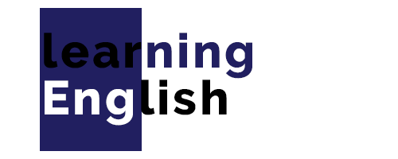

<!--
*** Thanks for checking out this README Template. If you have a suggestion that would
*** make this better, please fork the repo and create a pull request or simply open
*** an issue with the tag "enhancement".
*** Thanks again! Now go create something AMAZING! :D
-->


<!-- PROJECT SHIELDS -->
<!--
*** I'm using markdown "reference style" links for readability.
*** Reference links are enclosed in brackets [ ] instead of parentheses ( ).
*** See the bottom of this document for the declaration of the reference variables
*** for contributors-url, forks-url, etc. This is an optional, concise syntax you may use.
*** https://www.markdownguide.org/basic-syntax/#reference-style-links
-->
[![Contributors][contributors-shield]][contributors-url]
[![Forks][forks-shield]][forks-url]
[![Stargazers][stars-shield]][stars-url]
[![Issues][issues-shield]][issues-url]
[![MIT License][license-shield]][license-url]
[![LinkedIn][linkedin-shield]][linkedin-url]


<!-- PROJECT LOGO -->
<br />
<p align="center">
  <a href="https://github.com/dongnv/Baotri_UI">
    
  </a>

  <h3 align="center">English Learning Website for Busy People</h3>

  <p align="center">
    Hệ thống học tiếng Anh tiện lợi nhất cho người đi làm (Backend)
    <br />
    <a href="https://github.com/dongnvsince1999/Baotri_UI/archive/master.zip"><strong>Tải source code ngay »</strong></a>
    <br>
    <a href="https://github.com/dongnvsince1999/Baotri_UI/documents/Nhom04_CuoiKy.pdf"><strong>Xem báo cáo »</strong></a>
    <br>
    <a href="https://github.com/mirushi/EnglishLearningWeb"><strong>Source code Backend »</strong></a>
    <br />
    <br />
    <a href="https://github.com/dongnvsince1999/Baotri_UI">Xem Demo</a>
    ·
    <a href="https://github.com/dongnvsince1999/Baotri_UI/issues">Báo lỗi</a>
    ·
    <a href="https://github.com/dongnvsince1999/Baotri_UI/issues">Yêu cầu tính năng</a>
  </p>
</p>


<!-- TABLE OF CONTENTS -->
## Mục lục

- [Mục lục](#mục-lục)
- [Giới thiệu về dự án](#giới-thiệu-về-dự-án)
  - [Công nghệ sử dụng](#công-nghệ-sử-dụng)
- [Hướng dẫn cài đặt và sử dụng](#hướng-dẫn-cài-đặt-và-sử-dụng)
  - [Yêu cầu](#yêu-cầu)
  - [Cài đặt](#cài-đặt)
- [Sử dụng hệ thống](#sử-dụng-hệ-thống)
- [Hướng phát triển tương lai](#hướng-phát-triển-tương-lai)
- [Phát triển dự án](#phát-triển-dự-án)
- [Giấy phép](#giấy-phép)
- [Liên hệ](#liên-hệ)
- [Các thành phần đã sử dụng](#các-thành-phần-đã-sử-dụng)


<!-- ABOUT THE PROJECT -->
## Giới thiệu về dự án

[![Product Name Screen Shot][product-screenshot]](https://github.com/mirushi/EnglishLearningWeb)

Để đáp ứng yêu cầu học Anh Văn của người đi làm, chúng tôi thiết kế và xây dựng hệ thống trang Web cho phép người dùng tự học tiếng Anh ở bất cứ nơi đâu, bất kì khi nào. Hơn hết, chúng tôi nhắm vào đối tượng khách hàng chính là người đi làm, với những tính năng ưu việt từ Website đã được tối ưu hoá để mang lại trải nghiệm người dùng tối đa như :

*	Cho phép tra cứu nhanh chóng, thuận tiện bất kỳ mẫu ngữ pháp, từ vựng tiếng Anh nào.
*	Cho phép người dùng học theo từng bài, học theo chương, theo chủ đề.
*	Cho phép người dùng tạo tài khoản và quản lý thông tin tài khoản, thực hiện chức năng tự động nhắc nhở người dùng học tiếng Anh,…
*	Đặc biệt, cho phép người dùng chat với tất cả người dùng trên Website khác thông qua chat room.

Ngoài ra, ở khía cạnh người quản lý cho nội dung của Website (admin), chúng tôi còn cung cấp các tiện ích như :

*	Cho phép admin quản lý nội dung bài học ngay trên trang web (bao gồm Grammar, Vocabulary).
*	Cho phép admin quản lý tài khoản của các user khác (xem thông tin, chỉnh sửa thông tin).
*	Đặc biệt, cho phép admin quản lý các đoạn chat trong chat room một cách dễ dàng và hiệu quả.

### Công nghệ sử dụng
Để sản phẩm có thể chạy tốt và hiệu quả trên nhiều nền tảng khác nhau, nhóm đã nghiên cứu và phát triển BackEnd dựa trên các công nghệ hỗ trợ cross-platform tối đa.
* [Spring](https://spring.io/)
* [Hibernate ORM](https://hibernate.org/orm/)


<!-- GETTING STARTED -->
## Hướng dẫn cài đặt và sử dụng

Để có thể chạy được server ở phía BackEnd, các bạn có thể thực hiện theo các bước hướng dẫn như sau. 

### Yêu cầu
Phần hướng dẫn sau sử dụng Spring Tools Suite 4 (Eclipse) và được thực hiện trên hệ điều hành Windows. Các hệ điều hành khác có thể thực hiện tương tự.
* [Spring Tools Suite 4](https://spring.io/tools)
* [JDK 8](https://adoptopenjdk.net/?variant=openjdk8&jvmVariant=hotspot)

### Cài đặt

1. Tải và cài đặt Spring Tools Suite (cài đặt mặc định là đủ dùng).
2. Clone repository
```sh
git clone https://github.com/mirushi/EnglishLearningWeb.git
```
3. Chạy Spring Tools Suite và chọn File -> Import
4. Maven -> Existing Maven Projects
5. Ở mục Root Directory, chọn đến thư mục project chứa file pom.xml vừa clone về
6. Phải chuột vào project vừa import, chọn "Run As -> Spring Boot App".

<!-- USAGE EXAMPLES -->
## Sử dụng hệ thống

(Record Videos ?)

<!-- ROADMAP -->
## Hướng phát triển tương lai

Các tính năng chính mà nhóm dự định trong những môn học tới sẽ tiếp tục phát triển như sau :

* Flashcard vocabulary.


* Chức năng học chuyên sâu Grammar :
  * Làm bài tập.
    * Trắc nghiệm (được chia ra theo loại ngữ pháp).
    * Điền khuyết.
    * Chấm điểm và đưa ra đáp án đúng.
  * Đánh giá học viên.
    * Mức độ thông thạo.
    * Điểm yếu trong ngữ pháp.
    * Gợi ý luyện tập những phần còn yếu.

* Chức năng học chuyên sâu Listening :
  * Trang người dùng :
    * Làm dạng phim được cắt đoạn. 
    * Người dùng được phép nhập câu trả lời của mình vào.
    * Hệ thống sẽ tính điểm dựa trên câu trả lời của người dùng.
    * Tham khảo (supernative.tv).
  * Trang người quản trị :
    * Thêm/xoá/sửa video.
  * Một video bao gồm :
    * Đoạn subtitle.
    * Điểm.


Ngoài ra, bạn có thể đóng góp cho team những góp ý, tính năng mới thông qua mục [open issues](https://github.com/mirushi/EnglishLearningWeb/issues).


<!-- CONTRIBUTING -->
## Phát triển dự án

Team rất hoan nghênh những đóng góp và góp ý của bạn.

Để đóng góp đến project, bạn có thể thực hiện theo các bước sau : 

1. Fork Project
2. Tạo một nhánh Feature của bạn (`git checkout -b feature/AmazingFeature`)
3. Commit các thay đổi của bạn (`git commit -m 'Add some AmazingFeature'`)
4. Đẩy nhánh của bạn lên (`git push origin feature/AmazingFeature`)
5. Tạo một pull request

<!-- LICENSE -->
## Giấy phép

Source code được release theo giấy phép GPLv3. 

<!-- CONTACT -->
## Liên hệ
  #### Nguyễn Văn Đông ([Gmail](dongnv.since1999@gmail.com))
  #### Đinh Hoàng Luôn ([Gmail](dongnv.since1999@gmail.com))


<!-- ACKNOWLEDGEMENTS -->
## Các thành phần đã sử dụng
* [GitHub Emoji Cheat Sheet](https://www.webpagefx.com/tools/emoji-cheat-sheet)
* [Img Shields](https://shields.io)
* [Choose an Open Source License](https://choosealicense.com)
* [GitHub Pages](https://pages.github.com)
* [Animate.css](https://daneden.github.io/animate.css)
* [Loaders.css](https://connoratherton.com/loaders)
* [Slick Carousel](https://kenwheeler.github.io/slick)
* [Smooth Scroll](https://github.com/cferdinandi/smooth-scroll)
* [Sticky Kit](http://leafo.net/sticky-kit)
* [JVectorMap](http://jvectormap.com)
* [Font Awesome](https://fontawesome.com)


<!-- MARKDOWN LINKS & IMAGES -->
<!-- https://www.markdownguide.org/basic-syntax/#reference-style-links -->
[contributors-shield]: https://img.shields.io/github/contributors/mirushi/EnglishLearningWeb.svg?style=flat-square
[contributors-url]: https://github.com/mirushi/EnglishLearningWeb/graphs/contributors
[forks-shield]: https://img.shields.io/github/forks/mirushi/EnglishLearningWeb.svg?style=flat-square
[forks-url]: https://github.com/othneildrew/Best-README-Template/network/members
[stars-shield]: https://img.shields.io/github/stars/mirushi/EnglishLearningWeb.svg?style=flat-square
[stars-url]: https://github.com/mirushi/EnglishLearningWeb/stargazers
[issues-shield]: https://img.shields.io/github/issues/mirushi/EnglishLearningWeb.svg?style=flat-square
[issues-url]: https://github.com/mirushi/EnglishLearningWeb/issues
[license-shield]: https://img.shields.io/github/license/mirushi/EnglishLearningWeb.svg?style=flat-square
[license-url]: https://github.com/mirushi/EnglishLearningWeb/blob/master/LICENSE.txt
[linkedin-shield]: https://img.shields.io/badge/-LinkedIn-black.svg?style=flat-square&logo=linkedin&colorB=555
[linkedin-url]: https://linkedin.com
[product-screenshot]: https://github.com/mirushi/EnglishLearningWeb/raw/master/images/screenshot-homepage.png
